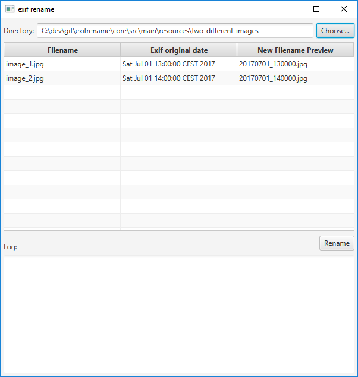

# EXIF Rename

Uses [metadata-extractor](https://github.com/drewnoakes/metadata-extractor) which can extract metadata from this file types:
* JPEG
* TIFF
* WebP
* PSD
* PNG
* BMP
* GIF
* ICO
* PCX
* Camera Raw
  * NEF (Nikon)
  * CR2 (Canon) 
  * ORF (Olympus) 
  * ARW (Sony)
  * RW2 (Panasonic)
  * RWL (Leica)
  * SRW (Samsung)
 
## Screenshot

